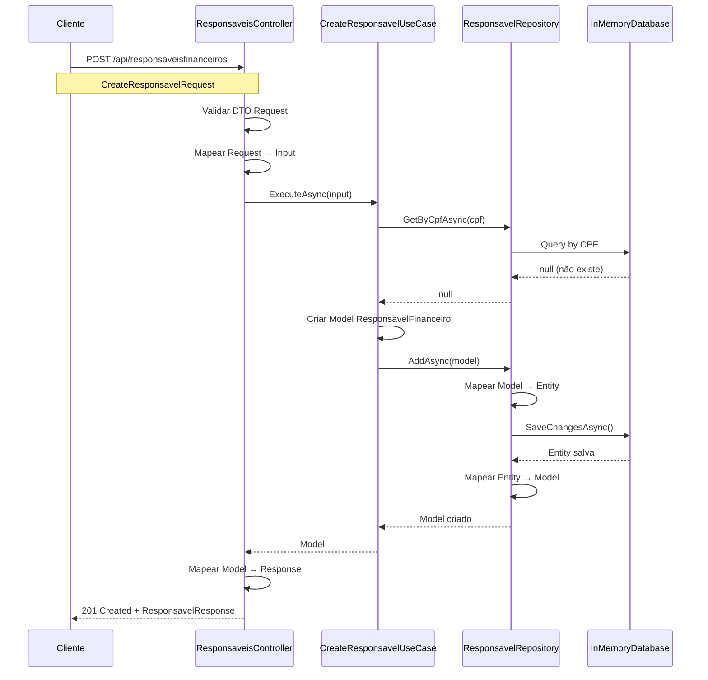
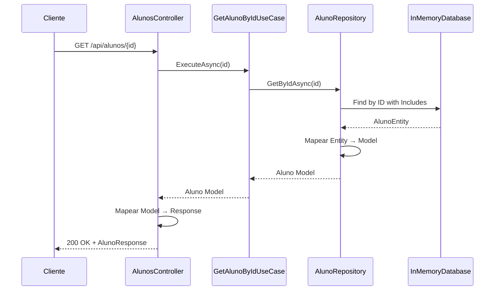
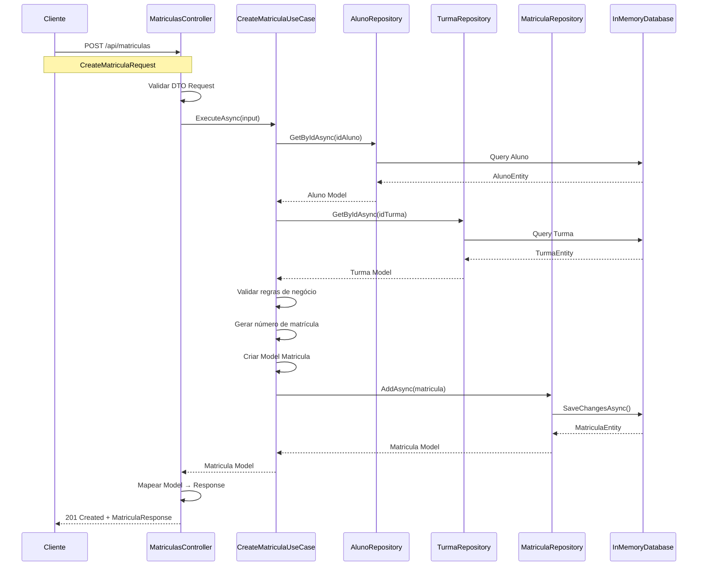
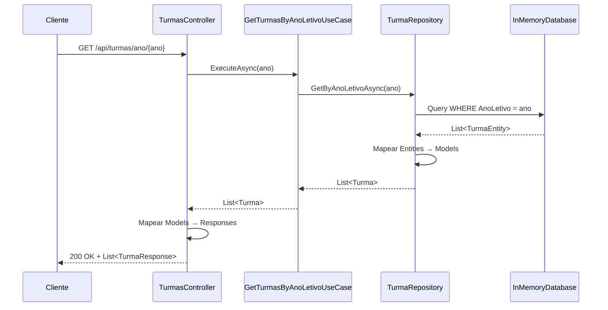
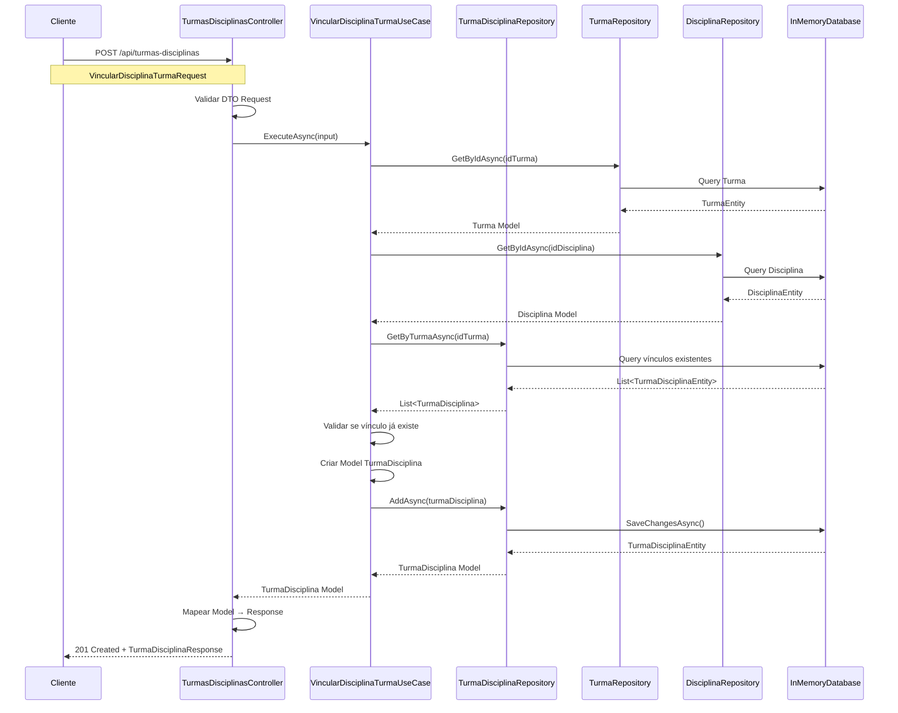

# 📚 SchoolSync - Sistema de Gestão Escolar

## 📋 Sumário
- [Visão Geral](#visão-geral)
- [Arquitetura](#arquitetura)
- [Estrutura do Projeto](#estrutura-do-projeto)
- [Camadas da Aplicação](#camadas-da-aplicação)
- [Fluxo DDD](#fluxo-ddd)
- [Diagramas de Sequência](#diagramas-de-sequência)
- [Tecnologias Utilizadas](#tecnologias-utilizadas)
- [Como Executar](#como-executar)
- [Endpoints da API](#endpoints-da-api)

---

## 🎯 Visão Geral

O **SchoolSync** é uma API RESTful de gestão escolar desenvolvida em **.NET 8** seguindo os princípios de **Domain-Driven Design (DDD)** e **Clean Architecture**. O sistema gerencia responsáveis financeiros, alunos, turmas, matrículas, disciplinas e notas.

### Características Principais
- ✅ Arquitetura em camadas (DDD)
- ✅ Separação de responsabilidades
- ✅ Entity Framework Core InMemory Database
- ✅ Padrão Repository
- ✅ Use Cases isolados
- ✅ DTOs para Request/Response
- ✅ Validações de dados
- ✅ Swagger para documentação

---

## 🏗️ Arquitetura

O projeto segue a arquitetura **DDD (Domain-Driven Design)** com 4 camadas principais:

```
┌─────────────────────────────────────────────────────────┐
│                     PRESENTATION                         │
│              (SchoolSync - Web API)                      │
│  Controllers │ DTOs (Request/Response) │ Mappings       │
└─────────────────────────────────────────────────────────┘
                           │
                           ▼
┌─────────────────────────────────────────────────────────┐
│                      APPLICATION                         │
│              (SchoolSync.Application)                    │
│              UseCases │ Inputs                           │
└─────────────────────────────────────────────────────────┘
                           │
                           ▼
┌─────────────────────────────────────────────────────────┐
│                        DOMAIN                            │
│               (SchoolSync.Domain)                        │
│            Models │ Interfaces                           │
└─────────────────────────────────────────────────────────┘
                           │
                           ▼
┌─────────────────────────────────────────────────────────┐
│                    INFRASTRUCTURE                        │
│            (SchoolSync.Infrastructure)                   │
│    DbContext │ Entities │ Repositories │ Mappings       │
└─────────────────────────────────────────────────────────┘
```

---

## 📁 Estrutura do Projeto

```
SchoolSync.sln
│
├── 📂 SchoolSync (Presentation Layer)
│   ├── 📂 Controllers
│   │   ├── ResponsaveisFinanceirosController.cs
│   │   ├── AlunosController.cs
│   │   ├── TurmasController.cs
│   │   └── MatriculasController.cs
│   ├── 📂 DTOs
│   │   ├── 📂 Requests
│   │   │   ├── CreateResponsavelRequest.cs
│   │   │   ├── UpdateResponsavelRequest.cs
│   │   │   └── ...
│   │   └── 📂 Responses
│   │       ├── ResponsavelFinanceiroResponse.cs
│   │       ├── AlunoResponse.cs
│   │       └── ...
│   ├── 📂 Mappings
│   │   ├── ResponsavelFinanceiroMappingProfile.cs
│   │   └── ...
│   └── Program.cs
│
├── 📂 SchoolSync.Application (Application Layer)
│   └── 📂 UseCases
│       ├── 📂 ResponsavelFinanceiro
│       │   ├── GetAllResponsaveisUseCase.cs
│       │   ├── GetResponsavelByIdUseCase.cs
│       │   ├── CreateResponsavelUseCase.cs
│       │   └── ...
│       ├── 📂 Aluno
│       ├── 📂 Turma
│       └── 📂 Matricula
│
├── 📂 SchoolSync.Domain (Domain Layer)
│   ├── 📂 Models
│   │   ├── ResponsavelFinanceiro.cs
│   │   ├── Aluno.cs
│   │   ├── Turma.cs
│   │   ├── Matricula.cs
│   │   ├── Disciplina.cs
│   │   ├── TurmaDisciplina.cs
│   │   └── Nota.cs
│   └── 📂 Interfaces
│       ├── IResponsavelFinanceiroRepository.cs
│       ├── IAlunoRepository.cs
│       └── ...
│
└── 📂 SchoolSync.Infrastructure (Infrastructure Layer)
    └── 📂 Data
        ├── 📂 Contexts
        │   └── SchoolSyncDbContext.cs
        ├── 📂 Entities
        │   ├── ResponsavelFinanceiroEntity.cs
        │   ├── AlunoEntity.cs
        │   └── ...
        ├── 📂 Mappings
        │   ├── ResponsavelFinanceiroMapping.cs
        │   └── ...
        └── 📂 Repositories
            ├── ResponsavelFinanceiroRepository.cs
            ├── AlunoRepository.cs
            └── ...
```

---

## 🔄 Camadas da Aplicação

### 1️⃣ **Presentation Layer** (SchoolSync)

**Responsabilidades:**
- Receber requisições HTTP
- Validar dados de entrada (DTOs Request)
- Chamar os Use Cases apropriados
- Formatar respostas (DTOs Response)
- Documentação Swagger

**Componentes:**
- **Controllers**: Endpoints REST da API
- **DTOs/Requests**: Classes para receber dados do cliente
- **DTOs/Responses**: Classes para enviar dados ao cliente
- **Mappings**: Conversão entre Request/Input e Model/Response

---

### 2️⃣ **Application Layer** (SchoolSync.Application)

**Responsabilidades:**
- Implementar regras de negócio
- Orquestrar operações entre repositórios
- Validar lógica de domínio
- Executar casos de uso específicos

**Componentes:**
- **UseCases**: Classes que implementam uma ação específica
  - Exemplo: `CreateResponsavelUseCase`, `GetAlunoByIdUseCase`
- **Inputs**: Classes que representam dados de entrada para os casos de uso

**Princípio:** Um Use Case = Uma Responsabilidade

---

### 3️⃣ **Domain Layer** (SchoolSync.Domain)

**Responsabilidades:**
- Definir entidades do negócio
- Estabelecer regras do domínio
- Definir contratos (interfaces)
- Representar o core da aplicação

**Componentes:**
- **Models**: Entidades de domínio puras (sem dependências de infraestrutura)
  - `ResponsavelFinanceiro`, `Aluno`, `Turma`, etc.
- **Interfaces**: Contratos dos repositórios
  - `IResponsavelFinanceiroRepository`, etc.

**Características:**
- Sem dependências externas
- Lógica de negócio pura
- Independente de frameworks

---

### 4️⃣ **Infrastructure Layer** (SchoolSync.Infrastructure)

**Responsabilidades:**
- Implementar acesso a dados
- Gerenciar persistência
- Configurar Entity Framework
- Implementar repositórios

**Componentes:**
- **Contexts**: DbContext do Entity Framework
- **Entities**: Classes que representam tabelas do banco
- **Repositories**: Implementações das interfaces do Domain
- **Mappings**: Conversão entre Entity e Model

---

## 🔀 Fluxo DDD

### Fluxo Completo de uma Requisição

```
┌──────────┐     ┌────────────┐     ┌──────────┐     ┌──────────────┐     ┌──────────┐
│  Cliente │────▶│ Controller │────▶│ Use Case │────▶│  Repository  │────▶│ Database │
└──────────┘     └────────────┘     └──────────┘     └──────────────┘     └──────────┘
     │                 │                  │                   │                   │
     │  HTTP Request   │                  │                   │                   │
     │                 │  DTO Request     │                   │                   │
     │                 │─────────────────▶│                   │                   │
     │                 │                  │  Input            │                   │
     │                 │                  │──────────────────▶│                   │
     │                 │                  │                   │  Entity Query     │
     │                 │                  │                   │──────────────────▶│
     │                 │                  │                   │◀──────────────────│
     │                 │                  │                   │  Entity           │
     │                 │                  │◀──────────────────│                   │
     │                 │                  │  Model            │                   │
     │                 │◀─────────────────│                   │                   │
     │                 │  Model           │                   │                   │
     │◀────────────────│                   │                   │                   │
     │  DTO Response   │                  │                   │                   │
```

### Detalhamento do Fluxo

1. **Cliente → Controller**
   - Cliente envia requisição HTTP com dados (JSON)
   - Controller recebe e valida o DTO Request

2. **Controller → Use Case**
   - Controller converte DTO Request para Input
   - Chama o Use Case apropriado

3. **Use Case → Repository**
   - Use Case implementa lógica de negócio
   - Chama métodos do repositório
   - Trabalha com Models do Domain

4. **Repository → Database**
   - Repository converte Model para Entity
   - Executa operações no DbContext
   - Entity Framework faz queries no banco

5. **Database → Repository**
   - Retorna Entity do banco
   - Repository converte Entity para Model

6. **Repository → Use Case**
   - Retorna Model do Domain

7. **Use Case → Controller**
   - Retorna Model processado

8. **Controller → Cliente**
   - Converte Model para DTO Response
   - Retorna resposta HTTP (JSON)

---

## 📊 Diagramas de Sequência

### 1. Criação de Responsável Financeiro



---

### 2. Buscar Aluno por ID



---

### 3. Criar Matrícula



---

### 4. Listar Turmas por Ano Letivo



---

### 5. Vincular Disciplina a uma Turma



---

## 🛠️ Tecnologias Utilizadas

| Tecnologia | Versão | Finalidade |
|------------|--------|------------|
| .NET | 8.0 | Framework principal |
| ASP.NET Core | 8.0 | Web API |
| Entity Framework Core | 8.0 | ORM |
| EF Core InMemory | 8.0 | Banco de dados em memória |
| Swagger/OpenAPI | 3.0 | Documentação da API |
| C# | 12.0 | Linguagem de programação |

### Pacotes NuGet Principais

```xml
<!-- SchoolSync (Presentation) -->
<PackageReference Include="Microsoft.AspNetCore.OpenApi" Version="8.0.0" />
<PackageReference Include="Swashbuckle.AspNetCore" Version="6.5.0" />

<!-- SchoolSync.Infrastructure -->
<PackageReference Include="Microsoft.EntityFrameworkCore" Version="8.0.0" />
<PackageReference Include="Microsoft.EntityFrameworkCore.InMemory" Version="8.0.0" />
```

---

## 🚀 Como Executar

### Pré-requisitos
- .NET 8 SDK instalado
- Visual Studio 2022 / VS Code / Rider

### Passos

1. **Clone o repositório**
```bash
git clone https://github.com/seu-usuario/schoolsync.git
cd schoolsync
```

2. **Restaurar dependências**
```bash
dotnet restore
```

3. **Compilar a solução**
```bash
dotnet build
```

4. **Executar a API**
```bash
cd SchoolSync
dotnet run
```

5. **Acessar o Swagger**
```
https://localhost:7xxx/swagger
```

### Dados Iniciais (Seed)

O banco InMemory é populado automaticamente na inicialização com:
- 3 Responsáveis Financeiros
- 3 Alunos
- 2 Turmas
- 5 Disciplinas
- 3 Matrículas
- Associações de Turmas e Disciplinas
- Notas de exemplo

---

## 📡 Endpoints da API

### Responsáveis Financeiros

| Método | Endpoint | Descrição |
|--------|----------|-----------|
| GET | `/api/responsaveisfinanceiros` | Lista todos os responsáveis |
| GET | `/api/responsaveisfinanceiros/{id}` | Busca responsável por ID |
| POST | `/api/responsaveisfinanceiros` | Cria novo responsável |
| PUT | `/api/responsaveisfinanceiros/{id}` | Atualiza responsável |
| DELETE | `/api/responsaveisfinanceiros/{id}` | Remove responsável |

### Alunos

| Método | Endpoint | Descrição |
|--------|----------|-----------|
| GET | `/api/alunos` | Lista todos os alunos |
| GET | `/api/alunos/{id}` | Busca aluno por ID |
| GET | `/api/alunos/responsavel/{idResponsavel}` | Lista alunos por responsável |
| POST | `/api/alunos` | Cria novo aluno |
| PUT | `/api/alunos/{id}` | Atualiza aluno |
| DELETE | `/api/alunos/{id}` | Remove aluno |

### Turmas

| Método | Endpoint | Descrição |
|--------|----------|-----------|
| GET | `/api/turmas` | Lista todas as turmas |
| GET | `/api/turmas/{id}` | Busca turma por ID |
| GET | `/api/turmas/ano/{ano}` | Lista turmas por ano letivo |
| POST | `/api/turmas` | Cria nova turma |
| PUT | `/api/turmas/{id}` | Atualiza turma |
| DELETE | `/api/turmas/{id}` | Remove turma |

### Matrículas

| Método | Endpoint | Descrição |
|--------|----------|-----------|
| GET | `/api/matriculas` | Lista todas as matrículas |
| GET | `/api/matriculas/{id}` | Busca matrícula por ID |
| GET | `/api/matriculas/aluno/{idAluno}` | Lista matrículas por aluno |
| POST | `/api/matriculas` | Cria nova matrícula |
| PUT | `/api/matriculas/{id}` | Atualiza matrícula |
| PATCH | `/api/matriculas/{id}/cancelar` | Cancela matrícula |
| DELETE | `/api/matriculas/{id}` | Remove matrícula |

### Disciplinas

| Método | Endpoint | Descrição |
|--------|----------|-----------|
| GET | `/api/disciplinas` | Lista todas as disciplinas |
| GET | `/api/disciplinas/ativas` | Lista apenas disciplinas ativas |
| GET | `/api/disciplinas/{id}` | Busca disciplina por ID |
| POST | `/api/disciplinas` | Cria nova disciplina |
| PUT | `/api/disciplinas/{id}` | Atualiza disciplina |
| DELETE | `/api/disciplinas/{id}` | Remove disciplina |

### Turmas-Disciplinas (Vínculos)

| Método | Endpoint | Descrição |
|--------|----------|-----------|
| POST | `/api/turmas-disciplinas` | Vincula uma disciplina a uma turma |
| GET | `/api/turmas-disciplinas/turma/{idTurma}` | Lista disciplinas de uma turma |
| GET | `/api/turmas-disciplinas/disciplina/{idDisciplina}` | Lista turmas de uma disciplina |
| PATCH | `/api/turmas-disciplinas/{id}/professor` | Atualiza o professor |
| DELETE | `/api/turmas-disciplinas/{id}` | Desvincula disciplina da turma |

---

## 🎯 Princípios Aplicados

### SOLID
- **S**ingle Responsibility: Cada classe tem uma única responsabilidade
- **O**pen/Closed: Aberto para extensão, fechado para modificação
- **L**iskov Substitution: Interfaces bem definidas
- **I**nterface Segregation: Interfaces específicas por contexto
- **D**ependency Inversion: Dependências através de abstrações

### Clean Architecture
- Separação clara de camadas
- Regras de dependência (sempre apontando para dentro)
- Domain no centro, sem dependências
- Infrastructure implementa interfaces do Domain

### DDD Patterns
- Entities (Models)
- Repositories
- Use Cases (Application Services)
- Value Objects (quando apropriado)
- Aggregates (relacionamentos entre entidades)

---

## 📝 Exemplo de Uso

### Criar um Responsável Financeiro

**Request:**
```http
POST /api/responsaveisfinanceiros
Content-Type: application/json

{
  "nome": "João Silva",
  "cpf": "123.456.789-00",
  "telefone": "(11) 98765-4321",
  "email": "joao.silva@email.com",
  "cidade": "São Paulo",
  "estado": "SP"
}
```

**Response:**
```http
HTTP/1.1 201 Created
Location: /api/responsaveisfinanceiros/4

{
  "idResponsavel": 4,
  "nome": "João Silva",
  "cpf": "123.456.789-00",
  "telefone": "(11) 98765-4321",
  "email": "joao.silva@email.com",
  "dataCadastro": "2025-10-26T10:30:00",
  "ativo": true
}
```

---

### Vincular Disciplina a uma Turma

**Request:**
```http
POST /api/turmas-disciplinas
Content-Type: application/json

{
  "idTurma": 1,
  "idDisciplina": 3,
  "professorNome": "Prof. Roberto Alves"
}
```

**Response:**
```http
HTTP/1.1 201 Created
Location: /api/turmas-disciplinas/turma/1

{
  "idTurmaDisciplina": 6,
  "idTurma": 1,
  "idDisciplina": 3,
  "professorNome": "Prof. Roberto Alves"
}
```

---

### Listar Disciplinas de uma Turma

**Request:**
```http
GET /api/turmas-disciplinas/turma/1
```

**Response:**
```http
HTTP/1.1 200 OK

[
  {
    "idTurmaDisciplina": 1,
    "idTurma": 1,
    "nomeTurma": "7º Ano A",
    "serie": "7º Ano",
    "anoLetivo": 2025,
    "idDisciplina": 1,
    "nomeDisciplina": "Matemática",
    "codigoDisciplina": "MAT001",
    "cargaHoraria": 80,
    "professorNome": "Prof. Carlos Mendes"
  },
  {
    "idTurmaDisciplina": 2,
    "idTurma": 1,
    "nomeTurma": "7º Ano A",
    "serie": "7º Ano",
    "anoLetivo": 2025,
    "idDisciplina": 2,
    "nomeDisciplina": "Português",
    "codigoDisciplina": "POR001",
    "cargaHoraria": 80,
    "professorNome": "Prof.ª Sandra Lima"
  }
]
```

---

## 🤝 Contribuindo

Este projeto é um exemplo educacional de implementação DDD. Contribuições são bem-vindas!

---

## 📄 Licença

Este projeto é fornecido como exemplo educacional.

---

## 👨‍💻 Autor

Desenvolvido como exemplo de arquitetura DDD com .NET 8.
